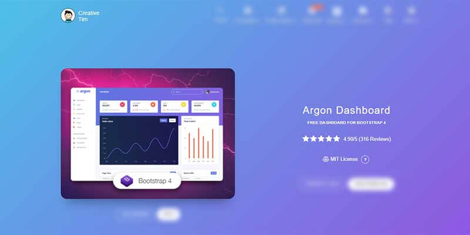

# Argon Dashboard Template

<SubHeading>Modern Bootstrap 4 Dashboard Template crafted by Creative-Tim</SubHeading>

**Argon Dashboard** is built with over 100 individual components, giving you the freedom of choosing and combining. All components can take variations in color, that you can easily modify using SASS files.

Using this free dashboard template you might save a lot of time going from prototyping to full-functional code because all elements are implemented. This Dashboard is coming with pre-built examples, so the development process is seamless, switching from our pages to the real website is very easy to be done.

- [Argon Dashboard](https://bit.ly/2KEZQiF) - product page hosted by [Creative-Tim](../partners/creative-tim.mdx)
- [Argon Dashboard](https://bit.ly/3vGM9Sm) - LIVE Deploy
- [Argon Dashboard](https://bit.ly/3h0Nj7q) - product documentation

 

## Resources

- 👉 [Admin dashboards](https://www.admin-dashboards.com/) - a huge index with templates and apps
- 👉 More [ui themes and templates](https://www.ui-themes.com/) - free & paid products
