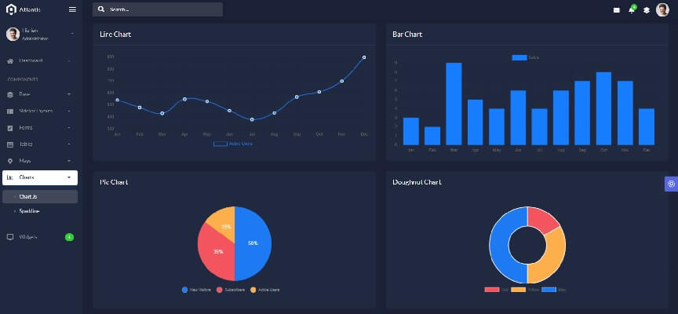

# Atlantis Lite Template

<SubHeading> Open-source Bootstrap Template</SubHeading>

**Atlantis Lite** is an open-source [**Bootstrap Template**](https://docs-old.appseed.us/bootstrap-template/) admin dashboard that is beautifully and elegantly designed to display various metrics, numbers or data visualization. **Atlantis Lite** admin dashboard has 2 layouts, many plugins and UI components to help developers create dashboards quickly and effectively so they can save development time and also help users to make the right and fast decisions based on existing data - provided by **ThemeKita**.

- [Atlantis Lite](https://www.themekita.com/atlantis-lite-bootstrap-dashboard.html) - product page
- [Atlantis Lite](https://atlantis-lite.appseed.us/) - product documentation

**100+ Components -** Atlantis Lite deeply customizes Bootstrap with a native look and feel. Available components include Cards, Charts, Notifications, Maps, Buttons, Inputs, and much more.

**Example pages -** Atlantis Lite comes with 6 premium example pages that we created to show you the beautiful user interfaces that can be created. Some of these pages are a pricing page, about page, contact page, log in, and register pages.

 

## ✅ Resources 

- 👉 Access [AppSeed](https://appseed.us/) and start fast your next project
- 👉 [Deploy Projects on Aws, Azure and Digital Ocean](https://www.docs.deploypro.dev/) via **DeployPRO**
- 👉 Create an amazing landing page with [Simpllo, an open-source site builder](https://www.simpllo.com/)
- 👉 [Django App Generator](https://app-generator.dev/django/) - A 2nd generation App Builder
