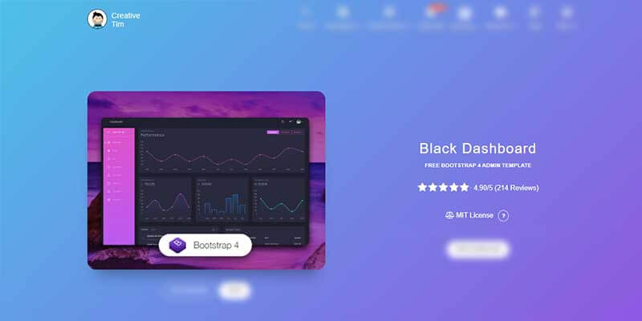

# Black Dashboard Template

<SubHeading>Free Bootstrap 4 Admin Dashboard with Dark Design</SubHeading>

**Black Dashboard** is a beautiful Bootstrap 4 Admin Dashboard with a huge number of components built to fit together and look amazing. If you are looking for a tool to manage and visualize data about your business, this dashboard is the thing for you. It combines colors that are easy on the eye, spacious cards, beautiful typography, and graphics. Black Dashboard comes packed with all plugins that you might need inside a project and documentation on how to get started. It is light and easy to use, and also very powerful.

- [Black Dashboard](https://bit.ly/2L0W6Z7) - product page hosted by [Creative-Tim](../partners/creative-tim.mdx)
- [Black Dashboard](https://bit.ly/33cmpRA) - LIVE Deploy
- [Black Dashboard](https://bit.ly/3tj1fMc) - official documentation

> Used By

- [Flask Black Dashboard](../../products/flask-dashboards/black-dashboard.mdx) - open-source seed project
- [Django Black Dashboard](../../products/django-dashboards/black-dashboard.mdx) - open-source seed project

**Black Dashboard** features over 16 individual components, giving you the freedom of choosing and combining. This means that there are thousands of possible combinations. All components can take variations in color, that you can easily modify using SASS files. You will save a lot of time going from prototyping to full-functional code because all elements are implemented.

 

## Resources

- 👉 [Admin dashboards](https://www.admin-dashboards.com/) - a huge index with templates and apps
- 👉 More [ui themes and templates](https://www.ui-themes.com/) - free & paid products
