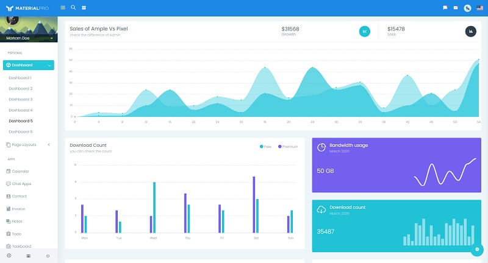

# MaterialPro Wpx

<SubHeading>Premium bootstrap material design template crafted by WrapPixel.</SubHeading>

WrapPixel’s **MaterialPro Bootstrap Admin** is a premium bootstrap material design template that comes packed with new, fresh, and attractive designs and ready-to-use components. Based on the popular Bootstrap 4 framework and inspired by Google’s material design, the MaterialPro Bootstrap Admin template is bundled with multiple third-party plugins that make it an excellent standalone solution.

- [MaterialPro Wpx](https://bit.ly/2NRHoFb) - product page hosted by [WrapPixel](../partners/wrappixel.mdx).
- [MaterialPro Wpx](https://bit.ly/3vKlRyJ) - product documentation

**Material Pro** Bootstrap Admin dashboard is versatile, user-friendly and has a clean code structure that optimizes the development cost and time. The smoothness and efficiency in using a customizable admin dashboard are felt with the reliable design inspiration by Google’s material design.

This premium material admin dashboard has a stupendous look and vibrancy with its ready-to-use components. Interestingly, this admin template can be used to create CRM admin panels, Sales dashboards, Analytical Admin dashboards, Performance-based admin dashboards, marketing dashboards, and many.

 

## Resources

- 👉 [Admin dashboards](https://www.admin-dashboards.com/) - a huge index with templates and apps
- 👉 More [ui themes and templates](https://www.ui-themes.com/) - free & paid products
