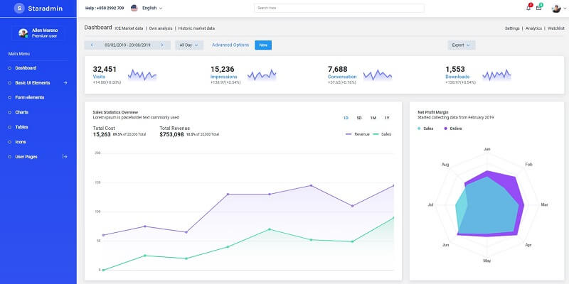
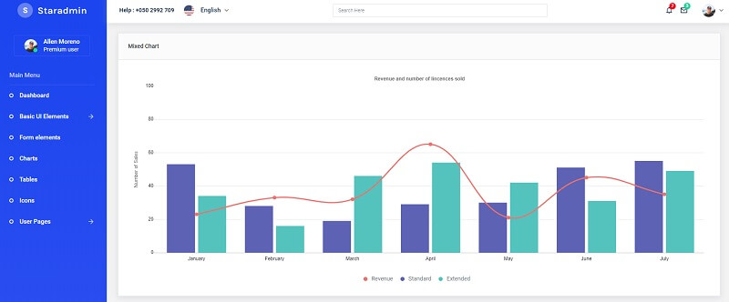

# [Star Admin](https://www.bootstrapdash.com/product/star-admin-free?ref=23)

<SubHeading>Open-source Bootstrap template crafted by BootstrapDash.</SubHeading>

Star Admin is a free responsive admin template built with Bootstrap 4. The template has a colorful, attractive yet simple and elegant design. The template is well crafted, with all the components neatly and carefully designed and arranged within the template.

> [Star Admin](https://www.bootstrapdash.com/product/star-admin-free?ref=23) - product page hosted by [BootstrapDash](../partners/bootstrapdash.mdx)

Star Admin is packed with all the features that fit your needs but not cramped with components you would not even use. It is an excellent fit to build admin panels, e-commerce systems, project management systems, CMS or CRM.



## How to build the template

To build Star Admin in a local environment, NodeJs, Yarn and Gulp must be properly installed and accessible in the terminal:

- [GIT](https://git-scm.com/) - command line versioning command
- [NodeJS](https://nodejs.org/en/) - version 10.x or above
- [Yarn](https://yarnpkg.com/) - a modern package manager
- [Gulp](https://gulpjs.com/) - installed globally.

if you're not sure if the required tools are already installed, open a terminal and type the following commands.

> Check NodeJs version/installation

```
$ node -v
v12.18.4
```

> Check Yarn version

```
$ yarn -v
1.22.5
```

> Install Gulp globally

```
$ npm install -g gulp-cli
```

After installation, we can check the Gulp version using `-v` argument.

```
$ gulp -v
CLI version: 2.3.0
```

Once the required tooling is accessible we can start compiling the Star Admin template.

> Step #1 - Clone/download Star Admin source code

```
$ git clone https://github.com/BootstrapDash/StarAdmin-Free-Bootstrap-Admin-Template.git
$ cd StarAdmin-Free-Bootstrap-Admin-Template
```

> Step #2 - Install modules (dependencies)

```
$ npm install
// OR
$ yarn
```

> Step #3 - Start the project

```
$ gulp
```

At this point, we can visit the app in the browser `http://localhost:3000`.



<br />

## ✅ Resources 

- 👉 Access [AppSeed](https://appseed.us/) and start fast your next project
- 👉 [Deploy Projects on Aws, Azure and Digital Ocean](https://www.docs.deploypro.dev/) via **DeployPRO**
- 👉 Create an amazing landing page with [Simpllo, an open-source site builder](https://www.simpllo.com/)
- 👉 [Django App Generator](https://app-generator.dev/django/) - A 2nd generation App Builder
