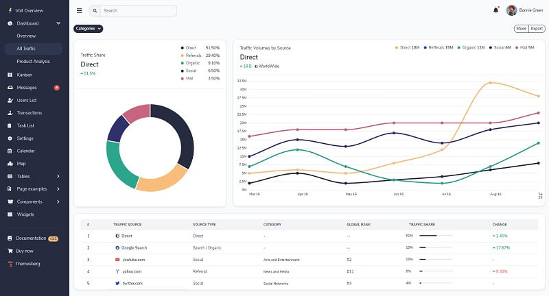

---
title:         Volt Dashboard PRO - Premium Template for Bootstrap 5
sidebar_label: Volt Dashboard PRO
--- 

# Volt Dashboard PRO

<SubHeading>Premium Bootstrap 5 template crafted by Themesberg.</SubHeading>

Volt Pro is a premium Bootstrap 5 Admin Dashboard featuring over 800 components, 20 example pages, and 10 fully customized plugins written in Vanilla Javascript.

- [Volt Dashboard Pro](https://themesberg.com/product/admin-dashboard/volt-premium-bootstrap-5-dashboard) - product page
- [Volt Dashboard Pro](https://demo.themesberg.com/volt-pro/) - LIVE demo

**800+ Components** - There are more than 800 premium Bootstrap 5 components included with the admin dashboard, some of which are buttons, forms, alerts, date pickers, range sliders, and many more.

**20+ Sample Pages** - Volt Pro comes with 20 example pages including the overview page, kanban drag and drop page, messages, user settings, transactions, calendar, sign in, sign up, and many more pages.

**Lightweight Plugins** - There are at least 10 lightweight Vanilla JS plugin libraries that we have customized and expanded in terms of features that you can use for your application. Some of these are a calendar, SVG maps, date pickers, notifications, drag and drop file uploads.

 

## Resources

- 👉 [Admin dashboards](https://www.admin-dashboards.com/) - a huge index with templates and apps
- 👉 More [ui themes and templates](https://www.ui-themes.com/) - free & paid products
