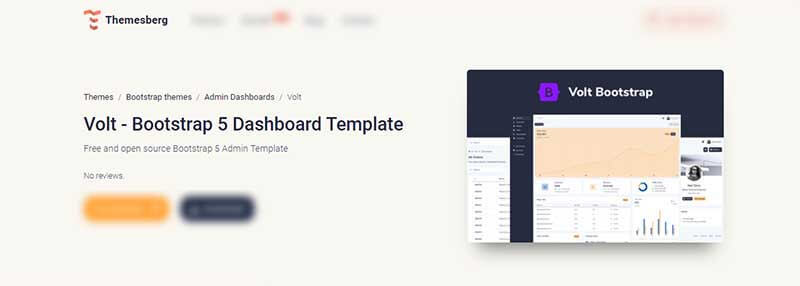

---
title:         Volt Dashboard - Open-Source Template for Bootstrap 5
sidebar_label: Volt Dashboard
--- 

# Volt Dashboard Template

<SubHeading>Free and open source Bootstrap 5 Admin Template</SubHeading>

Volt is a free and open-source **Bootstrap 5** powered admin dashboard with components, pages, and plugins that you can use to create an awesome admin interface. It also comes with a PRO Version with more pages, plugins, and components.

- [Volt Dashboard](https://themesberg.com/product/admin-dashboard/volt-bootstrap-5-dashboard) - product page hosted by [Themesberg](../partners/themesberg.mdx)
- [Volt Dashboard](https://themesberg.com/docs/volt-bootstrap-5-dashboard/getting-started/quick-start/) - official documentation

> Features and Plugins

This product is built using the following widely used technologies:

- Most popular CSS Framework Bootstrap
- Productive workflow tool Gulp
- Awesome CSS preprocessor Sass

**100+ Components** - There are more than 100 free **Bootstrap 5** components included some of them being buttons, alerts, modals, date pickers, all nicely documented via the official components docs.

**11 Example Pages** - Volt brings 11 example pages including an overview, sign in, sign up, transactions page, and many more.

**Lightweight Plugins** - There are 3 lightweight and Vanilla JS plugins that come with Volt, namely a date picker, notification, and charts library.

**Tooling** - Sass files and a Gulp commands file that will let you build minified and un-minified project files with the ability to even add certain blocks of code based on your environment.
 

## Resources

- 👉 [Admin dashboards](https://www.admin-dashboards.com/) - a huge index with templates and apps
- 👉 More [ui themes and templates](https://www.ui-themes.com/) - free & paid products
