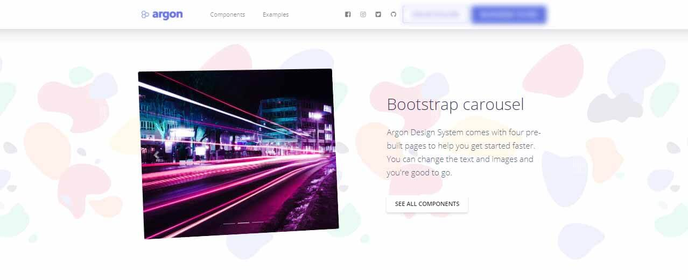

# Argon Design System

<SubHeading>Open-source design system provided by Creative-Tim</SubHeading>

Argon Design is an [open-source](https://en.wikipedia.org/wiki/Open-source_software) design system based on Bootstrap CSS Framework, crafted by [Creative-Tim](../partners/creative-tim.mdx) and released under MIT license. **Argon Design System** is built with over 100 individual components, giving you the freedom of choosing and combining. All components can take variations in color, that you can easily modify using SASS files.

- [Argon Design System](https://www.creative-tim.com/product/argon-design-system?AFFILIATE=128200) - product page
- [Argon Design System](https://demos.creative-tim.com/argon-design-system/index.html?AFFILIATE=128200) - LIVE Demo
- Related Products: [Argon PRO](https://www.creative-tim.com/product/argon-design-system-pro?AFFILIATE=128200) (premium version), [React](https://www.creative-tim.com/product/argon-dashboard-react?AFFILIATE=128200), [Vue](https://www.creative-tim.com/product/vue-argon-design-system?AFFILIATE=128200), [Flask](https://www.creative-tim.com/product/argon-dashboard-flask?AFFILIATE=128200), [Django](https://www.creative-tim.com/product/argon-dashboard-django?AFFILIATE=128200)

This Design System is coming with prebuilt examples, so the development process is seamless, switching from our pages to the real website is very easy to be done.

Every element has multiple states for colors, styles, hover, focus, that you can easily access and use.

 

## ✅ Resources 

- 👉 Access [AppSeed](https://appseed.us/) and start your next project
- 👉 [Deploy Projects on Aws, Azure and Digital Ocean](https://www.docs.deploypro.dev/) via **DeployPRO**
- 👉 Create an amazing landing page with [Simpllo, an open-source site builder](https://www.simpllo.com/)
- 👉 [Django App Generator](https://app-generator.dev/django/) - A 2nd generation App Builder
