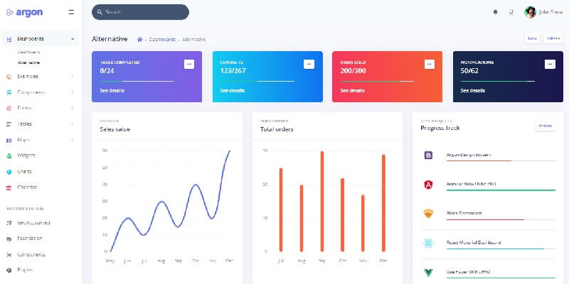

# [Django Argon PRO](https://appseed.us/product/argon-dashboard-pro/django/)

<SubHeading> Admin dashboard generated by AppSeed in Django on top of Argon Dashboard design (PRO version).</SubHeading>
**Argon Dashboard** is built with over 200 individual components, giving you the freedom of choosing and combining. This Dashboard is coming with pre-built examples, so the development process is seamless, switching from our pages to the real website is very easy to be done.

> Features

- Codebase - [Django Dashboard Boilerplate](../../boilerplate-code/django-dashboard.mdx)
- UI Kit: [Argon Dashboard PRO](../../content/bootstrap-template/argon-dashboard-pro.mdx) (premium version)
- SQLite Database, Django Native ORM
- Session-Based Authentication, Forms validation
- Deployment scripts: Docker, Gunicorn/Nginx

## What is Django

Django is a high-level Python Web framework that encourages rapid development and clean, pragmatic design. Built by experienced developers, it takes care of much of the hassle of Web development, so you can focus on writing your app without needing to reinvent the wheel. It’s free and open source.

> Read more about [Django Framework](../../content/what-is/django.mdx)

## How to use the App

- [Set up the environment](../../boilerplate-code/django-dashboard.mdx#environment-1) - prepare your workstation for **Django**
- [Compile the sources](../../boilerplate-code/django-dashboard.mdx#build-the-app-1) - start this **Django** app in the local environment
- [App Codebase](../../boilerplate-code/django-dashboard.mdx#app-codebase) - how the project files are organized
- [App Configuration](../../boilerplate-code/django-dashboard.mdx#app-configuration) - how to configure this **Django** application

## [Argon PRO](../../content/bootstrap-template/argon-dashboard-pro.mdx) - UI Kit

Argon is a completely new product built on our newest re-built from scratch framework structure that is meant to make our products more intuitive, more adaptive, and needless to say, so much easier to customize. Let Argon amaze you with its cool features and build tools and get your project to a whole new level.

- [Argon PRO](../../content/bootstrap-template/argon-dashboard-pro.mdx) - information provided by AppSeed
- [Argon Dashboard PRO](https://bit.ly/39D2BLX) - product page hosted by [Creative-Tim](../../content/partners/creative-tim.mdx)

