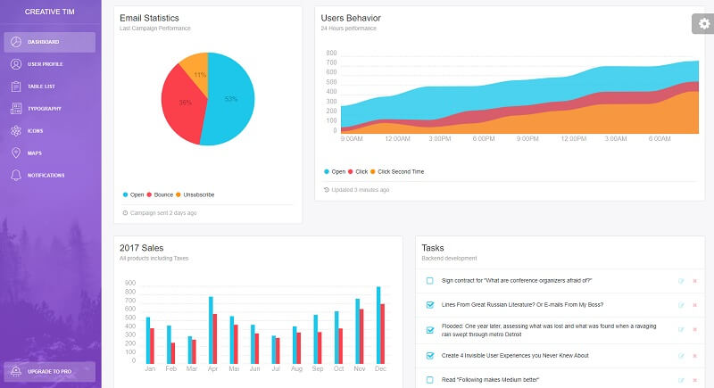

# [Flask Light Bootstrap](https://appseed.us/product/light-bootstrap-dashboard/flask/)

<SubHeading> Open-source Flask starter coded on top Light Bootstrap Dashboard design (free version). </SubHeading>

**Light Bootstrap Dashboard** is a Bootstrap 4 admin dashboard template designed to be beautiful and simple. It is built on top of Bootstrap 4 and it is fully responsive. It can be used to create admin panels, project management systems, web applications backend, CMS, or CRM.

> Features

- Codebase - [Flask Dashboard Boilerplate](../../boilerplate-code/starters/flask-dashboard.mdx)
- UI Kit: **Light Bootstrap Dashboard** (free version)
- DBMS: SQLite, PostgreSQL (production)
- DB Tools: SQLAlchemy ORM, Flask-Migrate (schema migrations)
- Modular design with **Blueprints**
- Session-Based authentication (via **flask_login**), Forms validation
- Deployment scripts: Docker, Gunicorn / Nginx, HEROKU

> Links

- [Light Bootstrap Dashboard Flask](https://appseed.us/product/light-bootstrap-dashboard/flask/) - product page
- [Light Bootstrap Dashboard Flask](https://github.com/app-generator/flask-dashboard-light-bootstrap) - source code
- [Light Bootstrap Dashboard Flask](https://flask-light-bootstrap.appseed-srv1.com/) - LIVE Demo

> [Support](https://appseed.us/support) (Email and LIVE on Discord) for **registered** [**AppSeed**](https://appseed.us/) **users**.

## What is Flask

**Flask** is a lightweight [WSGI](../../content/what-is/wsgi.mdx) web application framework. It is designed to make getting started quick and easy, with the ability to scale up to complex applications. Classified as a microframework, Flask is written in Python and it does not require particular tools or libraries. It has no database abstraction layer, form validation, or any other components where pre-existing third-party libraries provide common functions.

> Read more about [Flask Framework](../../content/what-is/flask.mdx)

## How to use the App

- [Set up the environment](../../boilerplate-code/starters/flask-dashboard.mdx#environment) - prepare your workstation for **Flask**
- [Compile the sources](../../boilerplate-code/starters/flask-dashboard.mdx#build-the-app-1) - start this **Flask** app in the local environment
- [App Codebase](../../boilerplate-code/starters/flask-dashboard.mdx#app-codebase) - how the project files are organized
- [App Configuration](../../boilerplate-code/starters/flask-dashboard.mdx#app-configuration) - how to configure this **Flask** application

## Light Bootstrap UI Kit

**Light Bootstrap Dashboard** contains multiple handpicked and optimized plugins. Everything is designed to fit with one another. It comes with a big collection of elements that will offer you multiple possibilities to create the app that best fits your needs.

- [Light Bootstrap Dashboard](../../content/bootstrap-template/light-bootstrap-dashboard.mdx) - more information provided by AppSeed
- [Light Bootstrap Dashboard](https://bit.ly/2ZEXOU3) - product page hosted by [Creative-Tim](../../content/partners/creative-tim.mdx)

