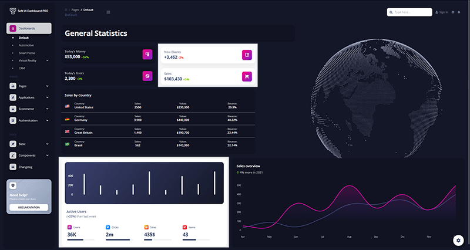

# [Flask Soft Dashboard PRO](https://appseed.us/product/soft-ui-dashboard-pro/flask/)

<SubHeading> Premium seed project built in Flask on top of Soft UI Dashboard (PRO version).</SubHeading>

Made of hundred of elements, designed blocks, and fully coded pages, [**Soft UI Dashboard PRO**](https://appseed.us/product/flask-soft-ui-dashboard-pro) is ready to help you create stunning websites and web apps. `Soft UI Dashboard PRO` is built with over 300 frontend individual elements, like buttons, inputs, navbars, nav tabs, cards, or alerts, giving you the freedom of choosing and combining.

> Features

- `Up-to-date dependencies`: **Flask 2.0.1**
- `SCSS compilation` via Gulp
- `DBMS`: SQLite, PostgreSQL (production)
- `DB Tools`: SQLAlchemy ORM, Flask-Migrate (schema migrations)
- Modular design with `Blueprints`
- `Session-Based authentication` (via flask_login), Forms validation
- `Deployment`: **Docker**, Gunicorn / Nginx, HEROKU

> Links

- [Soft UI Dashboard Flask PRO](https://appseed.us/product/soft-ui-dashboard-pro/flask/) - Product page
- [Soft UI Dashboard Flask PRO](https://flask-soft-ui-dashboard-pro.appseed-srv1.com/) - LIVE Demo

## What is Flask

**Flask** is a lightweight [WSGI](../../content/what-is/wsgi.mdx) web application framework. It is designed to make getting started quick and easy, with the ability to scale up to complex applications. Classified as a microframework, Flask is written in Python and it does not require particular tools or libraries. It has no database abstraction layer, form validation, or any other components where pre-existing third-party libraries provide common functions.

> Read more about [Flask Framework](../../content/what-is/flask.mdx)

## How to use the App

- [Set up the environment](../../boilerplate-code/starters/flask-dashboard.mdx#environment) - prepare your workstation for Flask
- [Compile the sources](../../boilerplate-code/starters/flask-dashboard.mdx#build-the-app) - start this Flask app in the local environment
- [App Codebase](../../boilerplate-code/starters/flask-dashboard.mdx#app-codebase-simplified) - how the project files are organized
- [App Configuration](../../boilerplate-code/starters/flask-dashboard.mdx#app-configuration) - how to configure this Flask application

## Soft Dashboard UI PRO

Premium Bootstrap 5 dashboard designed by `Creative-Tim`. This Premium Bootstrap 5 Dashboard is coming with prebuilt design blocks, so the development process is seamless, switching from our pages to the real website is very easy to be done.

- [Soft Dashboard UI PRO](https://www.creative-tim.com/product/soft-ui-dashboard-pro?AFFILIATE=128200) - Bootstrap5 version
- [Soft Dashboard UI PRO](https://demos.creative-tim.com/soft-ui-dashboard-pro/pages/dashboards/default.html?AFFILIATE=128200) - LIVE Demo

