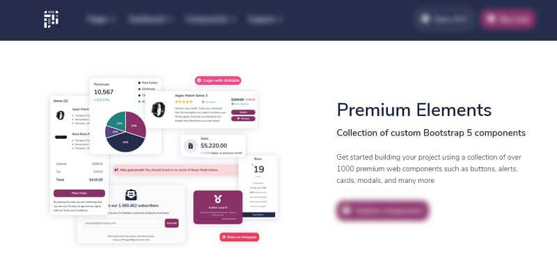

# Jinja Pixel PRO

<SubHeading>Jinja Template starter generated by the AppSeed platform on top of Pixel PRO (premium version)</SubHeading>

Pixel Pro is a premium **Bootstrap 5 UI Kit without jQuery** featuring over 1000 components, 50+ sections and 35 example pages including a fully-fledged user dashboard. The codebase is a super simple Flask project WITHOUT database, ORM, or any other hard dependency.

> Features:

- Codebase: [Jinja Starter](../../boilerplate-code/jinja.mdx)
- Render Engine: Flask / **Jinja2**
- Deployment scripts: Docker, Gunicorn/Nginx, HEROKU

> Links

- [Jinja Pixel PRO](https://appseed.us/jinja-template/jinja-pixel-uikit-pro) - product page
- [Jinja Pixel PRO](https://jinja-pixel-pro.appseed-srv1.com/) - LIVE deployment

> [Support](https://appseed.us/support) (Email and LIVE on Discord) for **registered** [**AppSeed**](https://appseed.us/) **users**.

## What is Jinja

[Jinja](https://jinja.palletsprojects.com/en/2.11.x/) is a modern and designer-friendly templating language for Python, modeled after Django’s templates. It is fast, widely used, and secure with the optional sandboxed template execution environment. Jinja is basically an engine used to generate HTML or XML returned to the user via an HTTP response.

> Read more about [Jinja Template Language](../../content/what-is/jinja.mdx)

## How to use the App

- [Set up the environment](../../boilerplate-code/jinja.mdx#environment) - prepare your workstation
- [Compile source code](../../boilerplate-code/jinja.mdx#build-the-app) - start the project in the local environment
- [Codebase structure](../../boilerplate-code/jinja.mdx#codebase-structure) - explains how the project files are organized
- [Deployment](../../boilerplate-code/jinja.mdx#deployment): Docker and HEROKU

## Pixel PRO UI Kit

A pixel-perfect design that comes with 35 pre-built pages and manually crafted UI components. **Pixel** is compliant with the latest UI design **accessibility standards** and passes the WAVE evaluation tool and the Achecker tool as well.

- [Pixel PRO](../../content/bootstrap-template/pixel-pro.mdx) - information provided by AppSeed
- [Pixel PRO](https://themesberg.com/product/ui-kit/pixel-pro-premium-bootstrap-5-ui-kit) - product page hosted by [Themesberg](../../content/partners/themesberg.mdx)

